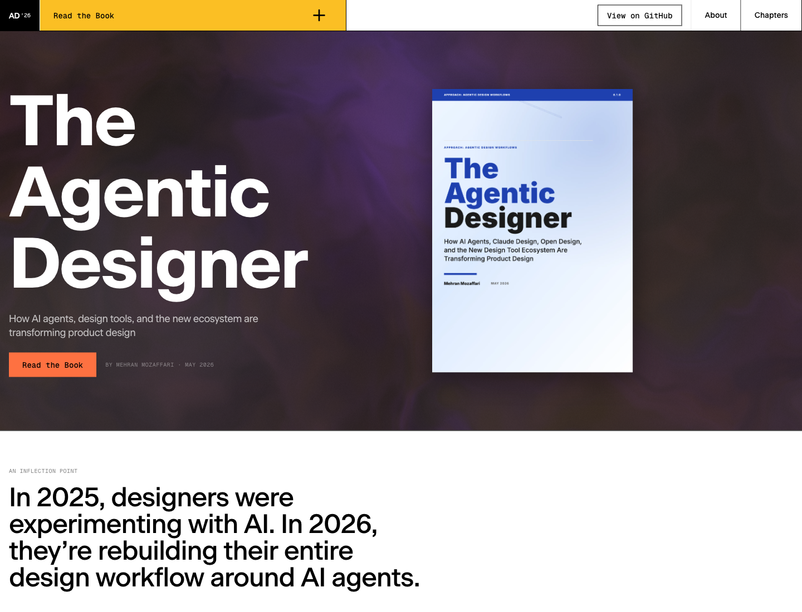

# The Agentic Designer

> How AI Agents, Claude Design, Open Design, and the New Design Tool Ecosystem Are Transforming Product Design · by Mehran Mozaffari

## Read Online

Read the book online on the dedicated website: [piazr.github.io/the-agentic-designer](https://piazr.github.io/the-agentic-designer/index.html). The web version is the best place to browse chapters, read in the browser, and share the book with others.

## What This Book Covers

The Agentic Designer covers the agentic design paradigm, agent platforms such as Claude Code, Codex CLI, OpenCode, and Gemini CLI, design-for-agents harnesses such as `CLAUDE.md`, `AGENTS.md`, and skill files, the emerging design tool ecosystem, design-as-code workflows, motion and video design, MCP integrations, multi-agent design teams, real-world case studies, and the future of autonomous design systems.

## Repository Contents

| Path | Purpose |
|------|---------|
| `README.md` | Public landing page for this book website repository |
| `index.html` | Homepage for the dedicated book website |
| `about.html` | About page |
| `chapters/` | Online chapter pages |
| `assets/` | Shared scripts, styles, fonts, and visual assets |
| `images/` | Book cover and chapter imagery |
| `website-preview.png` | Screenshot of the dedicated book website linked from this README |
| `llms.txt` | LLM and agent indexing metadata |

## About the Author

Mehran Mozaffari

## Contact the Author

- Blog: [https://piazr.github.io/applied-ai/](https://piazr.github.io/applied-ai/)
- GitHub: [https://github.com/imehr](https://github.com/imehr)

For corrections, errata, or licensing inquiries, please open an issue on this repository or contact the author through the channels above.

## Version

- **v0.1.1** — May 2026
- AI tools evolve rapidly; check official project documentation for current product behavior.
